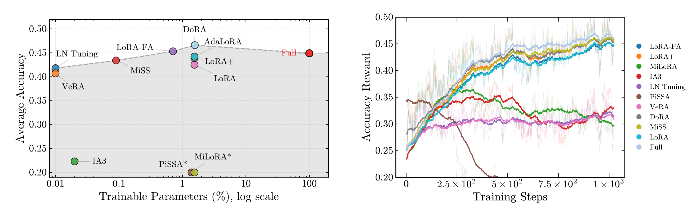

<div align="center">
</img>
  
# PeRL: Parameter-Efficient Reinforcement Learning  
> A minimal, modular, and lightning-fast framework for PEFT + RL.

| [**AlphaXiv**](https://www.alphaxiv.org/abs/2512.23165)
| [**ArXiv**](https://www.arxiv.org/abs/2512.23165)
| [**Checkpoints**](https://huggingface.co/MikaStars39/PeRL)
| [**Wandb Log**](https://wandb.ai/mikastars-zhejiang-university/PeRL_logs)

</div>

> [!IMPORTANT]
>
> PeRL is currently based on [TRL](https://github.com/huggingface/trl)
>
> We are actively developing on [verl](https://github.com/volcengine/verl) / [slime](https://github.com/THUDM/slime). Please refer to the modules.
> 
> Our evaluation is based on an in-house developed eval suit [MikaEval](https://github.com/MikaStars39/MikaEval).
>
> We thank for the contribution of [Tina](https://github.com/shangshang-wang/Tina) where our project was forked from its repo and we used part of its hyperparameter settings. We also utilize verifier functions, evaluation, and data from [openr1](https://github.com/huggingface/open-r1) and [JustRL](https://github.com/thunlp/JustRL).

## News

- [2026/01] 🔥 We are now adding support for [verl](https://github.com/volcengine/verl) and [slime](https://github.com/THUDM/slime)!
- [2025/12] 🔥 We released our code, paper, and checkpoints!

## About

PeRL is the first large-scale evaluation of over 12 PEFT methodologies using the DeepSeek-R1-Distill family on complex mathematical reasoning benchmarks.

**Key Finding:** Standard LoRA is suboptimal. Structural variants such as DoRA, AdaLoRA, and MiSS consistently outperform standard LoRA. Notably, DoRA (46.6% avg. accuracy) even surpasses full-parameter fine-tuning (44.9%) across multiple benchmarks.

**The failure of SVD-based initialization.**
Strategies like PiSSA and MiLORA experience significant performance degradation or total training collapse. This is due to a fundamental "spectral misalignment": these methods force updates on principal components, while RLVR intrinsically operates in the off-principal regime.

**The Expressivity Floor.**
While RLVR can tolerate moderate parameter reduction, extreme compression (e.g., VeRA, IA³, or Rank-1 adapters) creates an information bottleneck. Reasoning tasks require a minimum threshold of trainable capacity to successfully reorient policy circuits.


## Supported Parameter-Efficient Methods

| Method | Status | Description |
| :--- | :--- | :--- |
| **LoRA** | ✅ | Standard Low-Rank Adaptation |
| **DoRA** | ✅ | Weight-decomposed Low-Rank Adaptation |
| **MiSS** | ✅ | Mixture of Sub-Spaces (Efficient shard-sharing structure) |
| **AdaLoRA** | ✅ | Adaptive budget allocation for rank-adaptive matrices |
| **LoRA+** | ✅ | Differentiated learning rates for improved adaptation dynamics |
| **rsLORA** | ✅ | Rank stabilization scaling factors |
| **PiSSA** | ✅ | Principal Singular values & Singular vectors Adaptation |
| **MiLORA** | ✅ | Minor Singular components initialization |
| **LORA-FA** | ✅ | Memory-efficient adaptation with frozen projection matrix A |
| **VeRA** | ✅ | Vector-based Random Matrix Adaptation |
| **LN Tuning** | ✅ | Parameter-efficient tuning on Layer Normalization layers |
| **$IA^3$** | ✅ | Infused Adapter by Inhibiting and Amplifying Inner Activations |

## Environment Setup

PeRL is a lightweight, parameter-efficient training library built on top of TRL, verl, and slime. Our environment setup is designed to minimize dependencies for agile development. We recommend managing your development environment using [uv](https://docs.astral.sh/uv/).

### Environment Setup Using `uv`

1. **Create and Activate a Virtual Environment (Recommended)**

We highly recommend using a dedicated Python virtual environment:

```
python -m venv .venv
source .venv/bin/activate
```

2. **Install Core Dependencies**

Use `uv` to install all primary dependencies from `requirements.txt`:

```
uv pip install -r requirements.txt
```

If you don't have `uv` installed, [follow the official instructions](https://docs.astral.sh/uv/installation/) to install it.

3. **Install Performance-Enhancing Packages (Optional but Recommended)**

Certain modules (like `flash-attn`) accelerate training, especially for large models. Install them as follows:

```
uv pip install flash-attn --no-cache-dir --no-build-isolation
python -c "import flash_attn"  # Verify the installation
```

If you encounter installation issues with any optional packages (such as CUDA compatibility for `flash-attn`), refer to their [official documentation](https://github.com/Dao-AILab/flash-attention) for troubleshooting.

### Additional Notes

- For advanced experiments (e.g., multi-node training, distributed inference), you may want to customize or pin versions in `env/requirements_hard.txt`. 
- If you encounter dependency or environment issues, opening an issue in this repo or our Discord is welcome.

By following these steps, your environment will be ready for training and experimentation with PeRL.

## Training

```
source [your virtual env]/bin/activate
bash scripts/openr1/dapo_full.sh # run a full RL
bash scripts/openr1/dapo_lora.sh # run a lora RL
```
